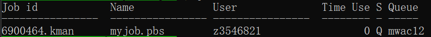

# Monitor Your Jobs (qstat, qdel, qalter)

## How the Scheduler Decides Which Jobs Run

When you submit a job to Katana, it is placed in a queue and handled by the scheduler. The scheduler decides when and where your job will run based on several factors:

- Available resources: Are there enough free CPUs, memory, GPUs, and walltime slots to run your job? Hence, if the system is busy or
resources are limited, your job may need to wait until enough become free.
- Requested walltime: Jobs asking for a shorter runtime are often easier to fit in and may start sooner. It can be difficult to estimate walltime accurately, but you test your code, it will be more familiar
- Fairness: The scheduler also considers how many resources you are currently using. If you are already running many jobs or using a large
amount of resources, your new jobs may need to wait longer so that others also get fair access.
- Queue waiting time: Jobs that have been waiting longer gain priority over newer submissions. This usually happens when a job remains
in the queue for a long time. The scheduler increments the job's priority over time, ensuring that older jobs eventually move ahead in the queue and get scheduled.

In short, the scheduler tries to balance efficiency (keeping the system busy) with fairness (making sure everyone gets a fair share of
resources).

Understanding these factors can help you make better choices about resource requests and job planning.

---

## Managing Your Own Jobs

Once your jobs are in the queue or running, you鈥檒l want to monitor and manage them. Common tasks include:

- **Checking job status**
- **Deleting jobs you no longer need**
- **Altering queued jobs (e.g. reducing walltime)**

On Katana, these taskes are manged using PBS commmands as follows:

### Checking Job Status with `qstat`

`qstat` shows the jobs currently in the queue. Without options it prints **all jobs**, so you may want to filter.

<div style="flex: 1; margin-right: 20px;">
		
</div>

#### Show Only Your Jobs

Use the `-u` option with your username or `$USER` environment variable (Which is automatically set to your username/zID):

<div style="flex: 1; margin-right: 20px;">
		
</div>
<div style="flex: 1; margin-right: 20px;">
		
</div>

In the output, you can see the job ID, name, user, time used, and status. The status codes are:

| State | Meaning                         |
| ----- | ------------------------------- |
| **Q** | Queued (waiting to start)       |
| **R** | Running                         |
| **C** | Completed (finished or stopped) |
| **H** | Held (paused by user or admin)  |
| **E** | Exiting (finishing up)          |
| **S** | Suspended (temporarily stopped) |
| **B** | Job arrays only: job array is begun, meaning that at least one subjob has started |
| **F** | Job is finished. Job has completed execution, job failed, or job was deleted. |
| **M** | Job is moved to another server. |


The `-s` option adds more detail such as which node the job is on:
```bash
[z1234567@katana2 src]$ qstat -su $USER
```

### Get Full Details of a Job
```bash
[z1234567@katana2 src]$ qstat -f 6900507
```
<div style="flex: 1; margin-right: 20px;">
		
</div>
This is useful for debugging and verifying resource requests.

If you want to see job status for a completed job, use the `-x` or `-H` option with the job ID:
```bash
[z1234567@katana2 src]$ qstat -H 6900507
```

---

### Deleting Jobs with `qdel`

If you need to delete a job, use `qdel` followed by the job ID:

```bash
[z1234567@katana2 src]$ qdel 315252
```

---

### Altering Jobs with `qalter`

If there is a need to reduce resource requests (e.g. walltime, memory) for a job that is still in the queue (not yet running), you can use `qalter`. For example, to change the number of CPUs and memory:

Example:  
```bash
# Submit a job with 2 CPUs and 128GB memory
[z1234567@katana2 src]$ qsub -l select=1:ncpus=2:mem=64gb job.pbs
315259.kman.restech.unsw.edu.au

# Change it to 4 CPUs and 128GB memory while queued
[z1234567@katana2 src]$ qalter -l select=1:ncpus=4:mem=128gb 315259
```

---

## Viewing Job Statistics After Completion

When a job finishes, PBS appends a resource usage summary to your output file. The output file contains both your program鈥檚 results (e.g. print statements) and PBS system information about how much memory and time your job actually used. For example:

```bash
z123456@katana2:~ $ cat 4638435.kman.restech.unsw.edu.au.OU

================================================================================
                     Resource Usage on 27/07/2023 15:43:37

Job Id: 4638435
Queue: CSE
Walltime: 00:00:03  (requested 01:00:00)
Job execution was successful. Exit Status 0.

--------------------------------------------------------------------------------
|              |             CPUs              |            Memory             |
--------------------------------------------------------------------------------
| Node         | Requested   Used   Efficiency | Requested   Used   Efficiency |
| k080         |     1        0.0      0.0%    |   1.0gb    0.01gb     1.0%    |
--------------------------------------------------------------------------------
```

!!! Note
    'cat' is used here to display the contents of the file. You can also use 'nano' to view it.

If you don鈥檛 know where your output file is, use `qstat -xf JOBID` and look for `Output_Path`. For example:

```bash
[z1234567@katana2:~]$ qstat -xf 4682962
    Output_Path = /home/z123456/output_file.txt
```

For interactive jobs, the output file will have a name like `4638435.kman.restech.unsw.edu.au.OU` in the directory you started the job.

---

## Checking Nodes and Jobs on the Cluster

### View All Nodes with `pstat`

The `pstat` command gives an overview of all compute nodes and what jobs are running on them:

```bash
[z1234567@katana2 src]$ pstat
Node  Group                  State        CPUs   Memory
k001  normal-mrcbio           free          12/44   200/1007gb
k002  normal-mrcbio           free          40/44    56/ 377gb
k003  normal-mrcbio           free          40/44   375/ 377gb
k004  normal-mrcbio           free          40/44    62/ 377gb
k005  normal-ccrc             free           0/32     0/ 187gb
k006  normal-physics          job-busy      32/32   180/ 187gb
...
```

In each row you can see the **node ID**, queue name, whether it鈥檚 free or busy, how many CPUs are in use, and memory usage.

### Detailed Info About One Node with `pbsnodes`

The `pbsnodes` command shows detailed information about nodes. Without arguments it can be overwhelming. Use it with a node name to narrow results:

```bash
[z1234567@katana2 src]$ pbsnodes k254
k254
    Mom = k254
    ntype = PBS
    state = job-busy
    pcpus = 32
    jobs = 313284.kman.restech.unsw.edu.au/0, 313284.kman.restech.unsw.edu.au/1
    resources_available.arch = linux
    resources_available.cputype = skylake-avx512
    resources_available.mem = 196396032kb
    resources_assigned.ncpus = 32
    resources_assigned.mem = 50331648kb
    sharing = default_shared
    last_state_change_time = Thu Apr 30 08:06:23 2020
```
This lets you check CPU type, available memory, assigned jobs, and more.

---

**Summary:**  
Typical workflow:

- Submit job 鈫� qsub myjob.pbs

- Check status 鈫� qstat -u $USER

- If needed, adjust 鈫� qalter 鈥� or cancel 鈫� qdel JOBID

- After it finishes, check output file 鈫� cat jobid.OU  

<<<<<<< Updated upstream
=======
For interactive jobs, the output file will have a name like `4638435.kman.restech.unsw.edu.au.OU` in the directory you started the job.

---

## Checking Nodes and Jobs on the Cluster

<h3> View All Nodes with `pstat` </h3>

The `pstat` command gives an overview of all compute nodes and what jobs are running on them:

```bash
[z1234567@katana2 src]$ pstat
Node  Group                  State        CPUs   Memory
k001  normal-mrcbio           free          12/44   200/1007gb
k002  normal-mrcbio           free          40/44    56/ 377gb
k003  normal-mrcbio           free          40/44   375/ 377gb
k004  normal-mrcbio           free          40/44    62/ 377gb
k005  normal-ccrc             free           0/32     0/ 187gb
k006  normal-physics          job-busy      32/32   180/ 187gb
...
```

In each row you can see the **node ID**, queue name, whether it鈥檚 free or busy, how many CPUs are in use, and memory usage.

<h3> Detailed Info About One Node with `pbsnodes` </h3>

The `pbsnodes` command shows detailed information about nodes. Without arguments it can be overwhelming. Use it with a node name to narrow results:

```bash
[z1234567@katana2 src]$ pbsnodes k254
k254
    Mom = k254
    ntype = PBS
    state = job-busy
    pcpus = 32
    jobs = 313284.kman.restech.unsw.edu.au/0, 313284.kman.restech.unsw.edu.au/1
    resources_available.arch = linux
    resources_available.cputype = skylake-avx512
    resources_available.mem = 196396032kb
    resources_assigned.ncpus = 32
    resources_assigned.mem = 50331648kb
    sharing = default_shared
    last_state_change_time = Thu Apr 30 08:06:23 2020
```
This lets you check CPU type, available memory, assigned jobs, and more.

---

**Summary:**  
Typical workflow:

- Submit job 鈫� qsub myjob.pbs

- Check status 鈫� qstat -u $USER

- If needed, adjust 鈫� qalter 鈥� or cancel 鈫� qdel JOBID

- After it finishes, check output file 鈫� cat jobid.OU  

>>>>>>> Stashed changes
